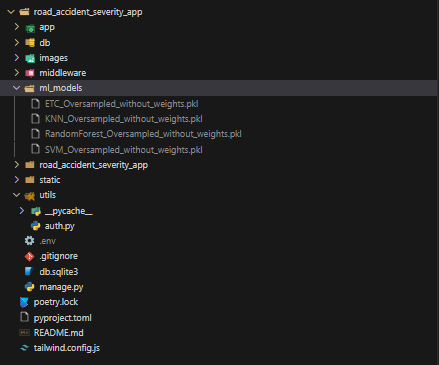

# Project Setup Guide

**Team Information**

<strong>Team Number:</strong> 28

<strong>Team Members:</strong>

<ul>
    <li><strong>Bhuvan Thirwani</strong> - 50565974</li>
    <li><strong>Harshit Malpani</strong> - 50608809</li>
    <li><strong>Piyush Gulhane</strong> - 50608504</li>
</ul>

**App Features**
<h4>1. Login & Registraion</h4>
<h4>2. Add/Edit/Delete Data for Road Accidents</h4>
<h4>3. Predict Accident Severity</h4>
<h4>4. Dynamic Chart Visualtization from the Dataset</h4>
<h4>5. ML Model Results</h4>
<h4>6. Guidelines</h4>

<h4>Video Link: <a href="https://drive.google.com/file/d/12MUpvx2y0xK9hq_jEnSePjqvCclMPQqi/view?usp=drive_link" target="_blank">Link</a> </h4>

This Instance may go down, if it goes down, I will update this link. Also, /login/ is important as / was not working.

**Setup Instructions**

<h3>1. Download the <code>ml_models.zip</code> File</h3>

First, download the <code>ml_models.zip</code> file from the following URL:

<a href="https://drive.google.com/file/d/10cMzD10C5Z5I2Zi-fZYxg8TdpM4yQV5r/view?usp=sharing" target="_blank">Download ml_models.zip</a>

<strong>Make sure to create a folder called <code>ml_models</code> in your project directory.</strong>

<h3>2. Install Dependencies</h3>

After setting up the <code>ml_models</code> folder, open your terminal/command prompt and follow these steps:

<ul>
    <li>Install Poetry (Dependency Manager):</li>
    <pre><code>pip install poetry</code></pre>
    
    <li>Install project dependencies (make sure you’re in the directory where <code>poetry.lock</code> exists):</li>
    <pre><code>poetry install</code></pre>
    
</ul>

<h3>3. Activate the Poetry Virtual Environment</h3>

Activate the virtual environment created by Poetry:

<pre><code>poetry shell</code></pre>

<h3>4. Run Database Migrations | You should be in road_accident_severity_app folder</h3>

To set up the database, run:

<pre><code>python manage.py migrate</code></pre>

<h3>5. Start the Server</h3>

Now, start the development server by running:

<pre><code>python manage.py runserver</code></pre>

**Register and Login**

Once the server is running, open your browser and go to the URL:

<pre><code>http://127.0.0.1:8000/login/</code></pre>

/login/ is important as / will not going to work

<h3>Register</h3>

First, register a new user by filling in the necessary details in the registration form.

<h3>Login</h3>

After registering, log in using your credentials.

**Start Using the Website**

Once logged in, you can start using the website and explore its features.

**Troubleshooting**

If you encounter any issues during the setup process, please ensure you’ve followed each step carefully. You can also check the following common issues:

<ul>
    <li>If <code>poetry install</code> doesn’t work, try updating Poetry by running:</li>
    <pre><code>pip install --upgrade poetry</code></pre>
    <li>Make sure that the virtual environment is activated before running server-related commands.</li>
</ul>

**Contact**

For any further queries, feel free to reach out to the team members:

<ul>
    <li><strong>Bhuvan Thirwani:</strong> bhuvanth@buffalo.edu</li>
    <li><strong>Harshit Malpani:</strong> hmalpani@buffalo.edu</li>
    <li><strong>Piyush Gulhane:</strong> pgulhane@buffalo.edu</li>
</ul>
</body>
</html>
